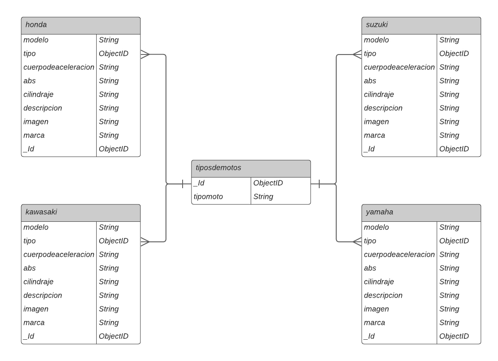

# MotoPedia 🏍️

MotoPedia es una pagina creada con la intención de dar un facil acceso a información basica de motocicletas de diferentes marcas para tener una rapida idea de sus capacidades con la intención de conocer sus prestaciones antes de por ejemplo adquirir una de estas, se inicializa con 4 marcas principales ***Suzuki***, ***Yamaha***, ***Kawasaki***, ***Honda*** se muestra ademas una descripción rapida de la motocicleta y su segmento para dar una mayor referencia para entender mejor donde se desempeña de mejor manera la motocicleta, 

Este proyecto está hecho por ***Diego Aceros*** estudiante de CampusLands haciendo practica de la tecnologia ***React*** para el FrontEnd visto en clase, la tecnologia ***NodeJs*** para el BackEnd y creación de los endPoints tomando la información de la base de datos creada en ***MongoDb***, se usan varios tipos de hooks nativos de React y Querys directas para la creación de los EndPoints todo el proyecto front esta Creado con CRA **(create-react-app)** es la primera practica de la union de estas 2 tecnologias.

## Instalación ⚙️

### Inicialización del servidor 

> ⚠️
> Antes de iniciar se da por hecho que en el equipo que intentas hacer los pasos ya tienes instalado ***NodeJs***

1. Para poder iniciar el proyecto clona el repositorio: ``https://github.com/Isomorphism21/MotoPedia.git``

2. Entra en la carpeta **Backend** usando el comando: 
``` 
cd .\backend\
```
3. Instala todas las librerias que usaron para la creación del **Backend** con el comando: 
``` 
npm i
```
4. Inicializa el servidor con el comando: 
``` 
npm run iso
```
//**Ya deberias de tener el servidor Inicializado**//

### Inicialización de React 


2. Entra en la carpeta **FrontEnd** usando el comando: 
``` 
cd .\frontend\
```
3. Instala todas las librerias que usaron para la creación del **FrontEnd** con el comando: 
``` 
npm i
```
4. Inicializa React con el comando: 
``` 
npm start
```
//**Se abrira automaticamente una pagina en tu navegador predeterminado en la dirección http://localhost:3000**//

## Diagrama de la base de datos
